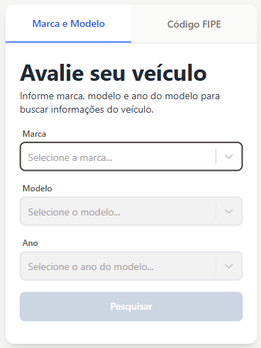
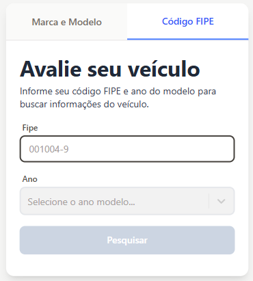
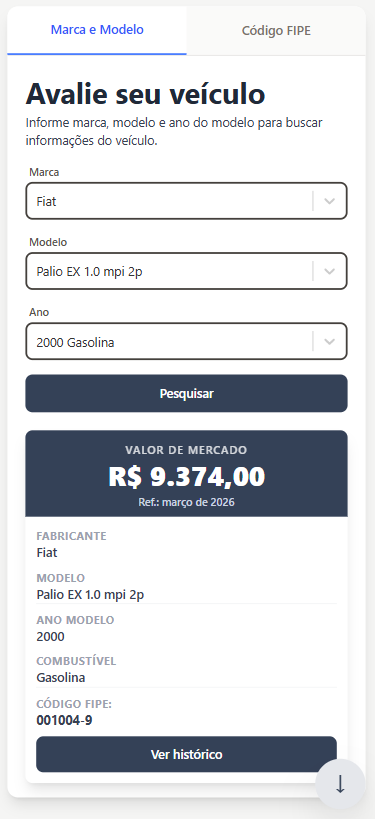
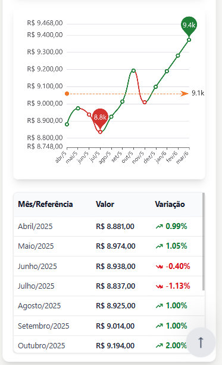

# 🚗Front-End React + TypeScript + Tailwind (FIPE)
[](https://github.com/frankkol)
[](https://linkedin.com/in/frankkol)

## Este front-end tem como objetivo permitir ao usuário a consulta do valor do veiculo, segundo avaliação FIPE e os dados históricos.

- Visualizar dados do veiculo (marca, modelo, ano, combustível);
- Visualizar valor de mercado corrente;
- Visão tabular dos valores e percentual de variação;
- Visão gráfica histórica do valor de mercado;


## Tecnologias
 - [React](https://react.dev/)
 - [TypeScript](https://www.typescriptlang.org/)
 - [Tailwind](https://tailwindcss.com/)
 - [ECharts](https://echarts.apache.org/)
 - [Brasil API](https://brasilapi.com.br/)

## 📸 Telas do sistema




## 🌐 API

#### Retorna as tabelas de referência existentes.

```http
  GET /fipe/tabelas/v1
```
```json
  [
    { "codigo": 271, "mes": "junho/2021" },
    ...
    { "codigo": 325,"mes": "setembro/2025" },
  ]
```

#### Retorna informações detalhadas sobre o preço de um veículo específico de acordo com a tabela FIPE

```http
  GET /fipe/preco/v1/{codigoFipe}
```
```json
  [
    {
      "valor": "R$ 6.022,00",
      "marca": "Fiat",
      "modelo": "Palio EX 1.0 mpi 2p",
      "anoModelo": 1998,
      "combustivel": "Álcool",
      "codigoFipe": "001004-9",
      "mesReferencia": "junho de 2021 ",
      "tipoVeiculo": 1,
      "siglaCombustivel": "Á",
      "dataConsulta": "segunda-feira, 7 de junho de 2021 23:05"
    }
  ]
```

#### Retorna informações detalhadas sobre o preço de um veículo específico de acordo com a tabela FIPE especifica

```http
  GET //fipe/preco/v1/{codigoFipe}?tabela_referencia={codigoTabela}
```

```json
  [
    {
      "valor": "R$ 6.022,00",
      "marca": "Fiat",
      "modelo": "Palio EX 1.0 mpi 2p",
      "anoModelo": 1998,
      "combustivel": "Álcool",
      "codigoFipe": "001004-9",
      "mesReferencia": "junho de 2021 ",
      "tipoVeiculo": 1,
      "siglaCombustivel": "Á",
      "dataConsulta": "segunda-feira, 7 de junho de 2021 23:05"
    }
  ]
```
| Parâmetro   | Tipo       | Descrição                                   |
| :---------- | :--------- | :------------------------------------------ |
| `codigoFipe`     | `String` | **Obrigatório**. Identificar único veiculo. |           |
| `codigoTabela`  | `Integer`| **Opcional**. ID da tabela referencia. |